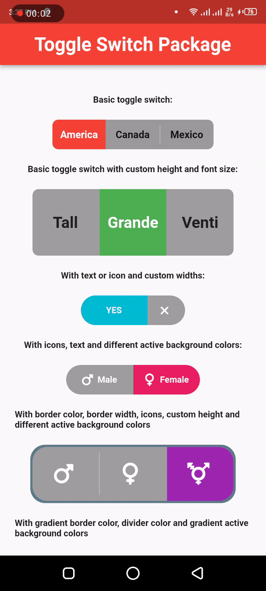

# toggle_switch_package_flutter

A new Flutter project.

## Getting Started

This project is a starting point for a Flutter application.

A few resources to get you started if this is your first Flutter project:

- [Lab: Write your first Flutter app](https://docs.flutter.dev/get-started/codelab)
- [Cookbook: Useful Flutter samples](https://docs.flutter.dev/cookbook)

For help getting started with Flutter development, view the
[online documentation](https://docs.flutter.dev/), which offers tutorials,
samples, guidance on mobile development, and a full API reference.

## 1. Research: Toggle Switch Package Flutter

- Keywords:
    - toggle_switch package in flutter
    - toggle_switch flutter package
    - toggle switch flutter
    - flutter switch
    - toggle switch flutter example
    - animated toggle button flutter
    - custom toggle button flutter
    - slide toggle button flutter
    - flutter toggle button only one
    - custom switch flutter
    - flutter switch button with text
    - custom switch button in flutter
    - flutter switch package
    - flutter switch example
    - flutter switch with text
    - flutter switch button with icon
    - toggle switch flutter
    - flutter toggle button size
    - flutter toggle button with text

- Video Title: Toggle Switch Package in Flutter - Toggle/Switch Button Animation with Text, Icon and
  Size

## 2. Research: Competitors

**Flutter Videos/Articles**

- 2.8K: https://www.youtube.com/watch?v=c8PGdcPA_PE
- 1.2K: https://www.youtube.com/watch?v=MzJwg1P9d-M
- 262: https://www.youtube.com/watch?v=ck2qfT7NEY0
- https://blog.logrocket.com/advanced-guide-flutter-switches-toggles/
- https://morioh.com/p/d7aa86e6ae1c
- https://www.google.com/search?q=toggle_switch+flutter+package

**Android/Swift/React Videos**

- 8.9K: https://www.youtube.com/watch?v=5xMPLe1gnOA
- 7.1K: https://www.youtube.com/watch?v=1waryiSoADs
- 3K: https://www.youtube.com/watch?v=I9CWsYOu754
- 4.6K: https://www.youtube.com/watch?v=NIU-jZfJNnY
- 1.9K: https://www.youtube.com/watch?v=r0Ck83V9cEA
- 11K: https://www.youtube.com/watch?v=xLBkqKJzFyE
- 820: https://www.youtube.com/watch?v=gx3M2Dr2j7c
- 1.6K: https://www.youtube.com/watch?v=ZbuC_SgGSfY
- 1K: https://www.youtube.com/watch?v=fgnaboX4MgM
- 4K: https://www.youtube.com/watch?v=yXdRDyvvlvQ
- https://abhiandroid.com/ui/togglebutton
- https://developer.android.com/develop/ui/views/components/togglebutton
- https://abhiandroid.com/ui/switch
- https://www.digitalocean.com/community/tutorials/android-toggle-button-switch-example
- https://www.tutlane.com/tutorial/android/android-switch-on-off-button-with-examples
- https://www.javatpoint.com/android-togglebutton-example
- https://www.hackingwithswift.com/quick-start/swiftui/how-to-create-a-toggle-switch
- https://betterprogramming.pub/how-to-use-switch-or-toggle-in-swiftui-b1a0f857ed5c
- https://medium.com/devtechie/toggle-switch-control-in-swiftui-1243a983f9ab
- https://blog.devgenius.io/swiftui-tutorial-working-with-toggle-5393d8e83f0b
- https://www.npmjs.com/package/toggle-switch-react-native
- https://reactscript.com/best-toggle-switch/
- https://www.geeksforgeeks.org/how-to-create-a-toggle-switch-in-react-native-using-material-design-library/
- https://reactnativeexample.com/tag/toggle/
- https://aboutreact.com/react-native-switch/

**Great Features**

- A simple toggle switch widget. It can be fully customized with desired icons, width, colors, text,
  corner radius etc.
- Find more features at [pub.dev](https://pub.dev/packages/toggle_switch).

**Problems from Videos**

- Question: Why does this toggle widget NOT change state in a stateful widget?

Answer: Follow
this [link](https://github.com/PramodJoshi/toggle_switch/issues/11#issuecomment-679277018).

**Problems from Flutter Stackoverflow**

- https://stackoverflow.com/questions/75147818/toggle-switch-animation-not-working-in-flutter
- https://stackoverflow.com/questions/70562560/toggle-switch-not-changing-position-after-app-language-is-changed-using-getx-pac
- https://stackoverflow.com/questions/59456086/flutter-toggle-switch-and-shared-preferences
- https://stackoverflow.com/questions/72496683/flutter-toggleswitch-doesn-t-change-color

## 3. Video Structure

**Main Points / Purpose Of Lesson**

1. You will learn how to make fully customizable toggle switch button with desired text, icons,
   width, height, colors and corner radius.
2. There are many UI shapes of toggle_switch button they all are shown in the video below.
3. This is very useful switch and you can easily customize and use it.

**The Structured Main Content**

1. Run `dart pub add toggle_switch` to add toggle_switch package in your project's pubspec.yaml
   file.
2. Run `dart pub add font_awesome_flutter` to use icons of font_awesome_flutter package in
   toggle_switch button.
3. `main.dart` file contains theming properties and its `MaterialApp` widget's `home` is
   calling `HomePage` widget from `home_page.dart` file.
4. Live preview and output of this project is shown in this video:
   <br/>
5. Properties of toggle_switch and their description are following:

| property            | Type                 | Description                                                                |
|:--------------------|:---------------------|:---------------------------------------------------------------------------|
| `totalSwitches`     | `int`                | Total number of switches                                                   |
| `labels`            | `List<String>`       | List of label strings to show on switch                                    |
| `borderColor`       | `List<Color>`        | Border color list w.r.t labels                                             |
| `borderWidth`       | `double`             | Border width of toggle switch                                              |
| `dividerColor`      | `Color`              | Divider color between labels                                               |
| `activeBgColor`     | `List<Color>`        | Active background color w.r.t labels                                       |
| `activeFgColor`     | `Color`              | Active foreground color                                                    |
| `inactiveBgColor`   | `Color`              | Inactive background color                                                  |
| `inactiveFgColor`   | `Color`              | Inactive foreground color                                                  |
| `onToggle`          | `void Function(int)` | on toggle function                                                         |
| `cornerRadius`      | `double`             | cornerRadius of toggle_switch. By default 8.0                              |
| `initialLabelIndex` | `int`                | which label should be by default selected                                  |
| `minWidth`          | `double`             | minimum width of switch. By default 72.0                                   |
| `minHeight`         | `double`             | minimum height of switch. By default 40.0                                  |
| `changeOnTap`       | `bool`               | change selection on tap. By default true                                   |
| `icons`             | `List<IconData>`     | List of icons w.r.t labels                                                 |
| `activeBgColors`    | `List<List<Color>>`  | List of background colors for active labels                                |
| `customTextStyles`  | `List<TextStyle>`    | List of TextStyle w.r.t labels                                             |
| `customIcons`       | `List<Icon>`         | List of custom(can change properties) icons                                |
| `customWidths`      | `List<double>`       | List of custom widths w.r.t labels                                         |
| `customHeights`     | `List<double>`       | List of custom heights w.r.t labels                                        |
| `animate`           | `bool`               | By default is false. Set to true when use `curve` property                 |
| `animationDuration` | `int`                | Animation duration. By default is 800 milliseconds                         |
| `curve`             | `Curve`              | Set `animate` to true to use `curve`. By default is `Curves.easeIn         |
| `radiusStyle`       | `bool`               | Set style of radius for every label using `cornerRadius`. By default false |
| `textDirectionRTL`  | `bool`               | Confirm if text direction is set right-to-left. By default false           |
| `fontSize`          | `double`             | fontSize of every text of label. By default 14.0                           |
| `iconSize`          | `double`             | iconSize of every icon of label. By default 17.0                           |
| `dividerMargin`     | `double`             | Margin of divider of every label. By default 8.0                           |
| `doubleTapDisable`  | `bool`               | Tap active switch to de-activate/de-select                                 |
| `isVertical`        | `bool`               | Use toggle switch vertically                                               |
| `activeBorders`     | `List<Border>`       | Set a border only to the active toggle component                           |

<br>

6. Usages:

### Basic toggle switch

```dart
// Here, default theme colors are used for activeBgColor, activeFgColor, inactiveBgColor and inactiveFgColor
ToggleSwitch
(
initialLabelIndex: 0,
totalSwitches: 3,
labels: ['America', 'Canada', 'Mexico'],
onToggle: (index) {
print('switched to: $index');
},
)
,
```


### Basic toggle switch with custom height and font size

```dart
ToggleSwitch
(
minWidth: 90.0,
minHeight: 90.0,
fontSize: 16.0,
initialLabelIndex: 1,
activeBgColor: [Colors.green],
activeFgColor: Colors.white,
inactiveBgColor: Colors.grey,
inactiveFgColor: Colors.grey[900],
totalSwitches: 3,
labels: ['Tall', 'Grande', 'Venti'],
onToggle: (index) {
print('switched to: $index');
},
)
,
```


### With text or icon and custom widths

```dart
ToggleSwitch
(
customWidths: [90.0, 50.0],
cornerRadius: 20.0,
activeBgColors: [[Colors.cyan], [Colors.redAccent]],
activeFgColor: Colors.white,
inactiveBgColor: Colors.grey,
inactiveFgColor: Colors.white,
totalSwitches: 2,
labels: ['YES', ''],
icons: [null, FontAwesomeIcons.times],
onToggle: (index) {
print('switched to: $index');
},
)
,
```


### With icons, text and different active background colors

```dart
ToggleSwitch
(
minWidth: 90.0,
initialLabelIndex: 1,
cornerRadius: 20.0,
activeFgColor: Colors.white,
inactiveBgColor: Colors.grey,
inactiveFgColor: Colors.white,
totalSwitches: 2,
labels: ['Male', 'Female'],
icons: [FontAwesomeIcons.mars, FontAwesomeIcons.venus],
activeBgColors: [[Colors.blue],[Colors.pink]],
onToggle: (index) {
print('switched to: $index');
},
)
,
```


### With border color, border width, icons, custom height and different active background colors

```dart
ToggleSwitch
(
minWidth: 90.0,
minHeight: 70.0,
initialLabelIndex: 2,
cornerRadius: 20.0,
activeFgColor: Colors.white,
inactiveBgColor: Colors.grey,
inactiveFgColor: Colors.white,
totalSwitches: 3,
icons: [
FontAwesomeIcons.mars,
FontAwesomeIcons.venus,
FontAwesomeIcons.transgender
],
iconSize: 30.0,
borderWidth: 2.0,
borderColor: [Colors.blueGrey],
activeBgColors: [[Colors.blue], [Colors.pink], [Colors.purple]],
onToggle: (index) {
print('switched to: $index');
},
)
,
```


### With gradient border color, divider color and gradient active background colors

```dart
ToggleSwitch
(
minWidth: 90.0,
minHeight: 70.0,
initialLabelIndex: 0,
cornerRadius: 20.0,
activeFgColor: Colors.white,
inactiveBgColor: Colors.grey,
inactiveFgColor: Colors.white,
totalSwitches: 3,
icons: [
FontAwesomeIcons.facebook,
FontAwesomeIcons.twitter,
FontAwesomeIcons.instagram
],
iconSize: 30.0,
borderColor: [Color(0xff3b5998), Color(0xff8b9dc3), Color(0xff00aeff), Color(0xff0077f2), Color(0xff962fbf), Color(0xff4f5bd5)],
dividerColor: Colors.blueGrey,
activeBgColors: [[Color(0xff3b5998), Color(0xff8b9dc3)], [Color(0xff00aeff), Color(0xff0077f2)], [Color(0xfffeda75), Color(0xfffa7e1e), Color(0xffd62976), Color(0xff962fbf), Color(0xff4f5bd5)]],
onToggle: (index) {
print('switched to: $index');
},
)
,
```


### With bounceInOut animation

```dart
ToggleSwitch
(
minWidth: 90.0,
minHeight: 70.0,
initialLabelIndex: 0,
cornerRadius: 20.0,
activeFgColor: Colors.white,
inactiveBgColor: Colors.grey,
inactiveFgColor: Colors.white,
totalSwitches: 2,
icons: [
FontAwesomeIcons.lightbulb,
FontAwesomeIcons.solidLightbulb,
],
iconSize: 30.0,
activeBgColors: [[Colors.black45, Colors.black26], [Colors.yellow, Colors.orange]],
animate: true, // with just animate set to true, default curve = Curves.easeIn
curve: Curves.bounceInOut, // animate must be set to true when using custom curve
onToggle: (index) {
print('switched to: $index');
},
)
,
```


### With radius style

```dart
ToggleSwitch
(
minWidth: 90.0,
cornerRadius: 20.0,
activeBgColors: [[Colors.green[800]!], [Colors.red[800]!]],
activeFgColor: Colors.white,
inactiveBgColor: Colors.grey,
inactiveFgColor: Colors.white,
initialLabelIndex: 1,
totalSwitches: 2,
labels: ['True', 'False'],
radiusStyle: true,
onToggle: (index) {
print('switched to: $index');
},
)
,
```


### With custom text styles, null initial label, double tap to de-activate

```dart
ToggleSwitch
(
minWidth: 90.0,
cornerRadius: 20.0,
inactiveFgColor: Colors.white,
initialLabelIndex: null,
doubleTapDisable: true, // re-tap active widget to de-activate
totalSwitches: 3,
labels: ['Normal', 'Bold', 'Italic'],
customTextStyles: [
null,
TextStyle(
color: Colors.brown,
fontSize: 18.0,
fontWeight: FontWeight.w900),
TextStyle(
color: Colors.black,
fontSize: 16.0,
fontStyle: FontStyle.italic)
],
onToggle: (index) {
print('switched to: $index');
},
)
,
```


### With custom icons

```dart
ToggleSwitch
(
minWidth: 90.0,
minHeight: 90.0,
cornerRadius: 20.0,
activeBgColors: [
[Color(0xfffdbb0a)],
[Colors.black54],
[Colors.white54]
],
inactiveFgColor: Colors.white,
initialLabelIndex: 2,
totalSwitches: 3,
customIcons: [
Icon(
FontAwesomeIcons.ccVisa,
color: Color(0xff1a1f71),
size: 55.0,
),
Icon(
FontAwesomeIcons.ccMastercard,
color: Color(0xffF79E1B),
size: 55.0,
),
Icon(
FontAwesomeIcons.ccAmex,
color: Color(0xff27AEE3),
size: 55.0,
)
],
onToggle: (index) {
print('switched to: $index');
},
)
,
```


### Vertical toggle switch with active border

```dart
ToggleSwitch
(
activeBorders: [
Border.all(
color: Colors.purple,
width: 3.0,
),
Border.all(
color: Colors.yellow.shade700,
width: 3.0,
),
Border.all(
color: Colors.deepOrangeAccent,
width: 3.0,
),
Border.all(
color: Colors.blue.shade500,
width: 3.0,
),
],
activeFgColor: Colors.black54,
isVertical: true,
minWidth: 150.0,
radiusStyle: true,
cornerRadius: 20.0,
initialLabelIndex: 2,
activeBgColors: [
[Colors.purpleAccent],
[Colors.yellow],
[Colors.orange],
[Colors.lightBlueAccent]
],
labels: ['Spring', 'Summer', 'Fall', 'Winter'],
onToggle: (index) {
print('switched to: $index');
},
)
,
```


### Custom widths greater than device width

```dart
SingleChildScrollView
(
scrollDirection: Axis.horizontal,
child: Scrollbar(
child: Padding(
padding: const EdgeInsets.symmetric(horizontal: 10.0),
child: ToggleSwitch(
customWidths: [300.0, 100.0, 100.0],
cornerRadius: 20.0,
activeBgColors: [
[Colors.green],
[Colors.redAccent],
[Colors.blue]
],
activeFgColor: Colors.white,
inactiveBgColor: Colors.grey,
inactiveFgColor: Colors.white,
labels: ['Yes, the statement above is true', 'False', 'Other'],
onToggle: (index) {
print('switched to: $index');
},
)
,
)
,
)
,
)
,
```


### TextDirection.rtl and corner radius

```dart
// When ToggleSwitch is used with Directionality widget and textDirection is set to TextDirection.rtl (right-to-left), 
// switches are displayed right to left along with their respective index values. In this case, corner radius of switches aren't set correctly. 
// To fix this, please use textDirectionRTL parameter and set it to true as shown in the example below. 
Directionality
(
textDirection: TextDirection.rtl,
child: ToggleSwitch(
initialLabelIndex: 0,
cornerRadius: 12.0,
textDirectionRTL: true,
activeFgColor: Colors.white,
totalSwitches: 2,
labels: ['left', 'right'],
onToggle: (index) {
print('switched to: $index');
},
)
,
)
,
```

### setState() inside onToggle

[Example code with explanation](https://github.com/PramodJoshi/toggle_switch/issues/11#issuecomment-679277018)